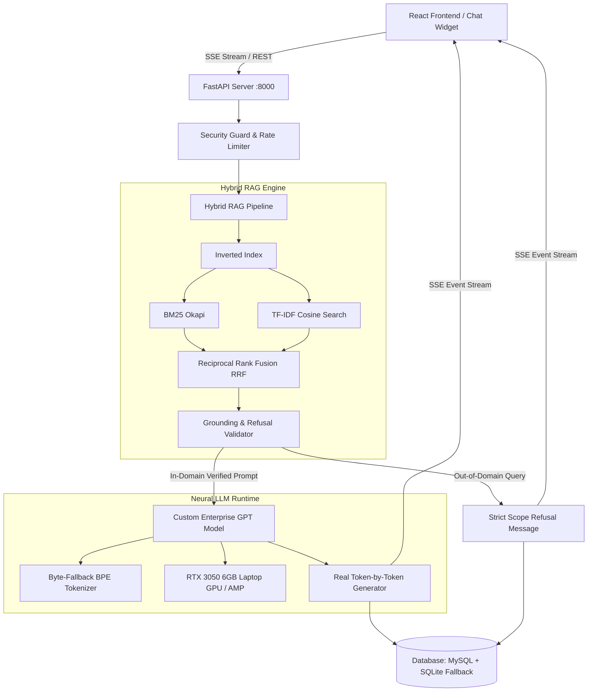

# Genkit AI v6.0 System Architecture

## 1. High-Level Overview

Genkit AI is a **100% self-hosted, custom enterprise language model and hybrid RAG system**. It operates with **zero external AI dependencies**, using a locally trained PyTorch neural model and an algorithmic lexical retrieval pipeline.



---

## 2. Directory & Component Layout

```
Chatbot-own-model/
├── backend/
│   ├── app/
│   │   ├── api/             # FastAPI Route Modules (/chat, /stream, /leads, /health)
│   │   ├── core/            # Configuration, Logger, Security, Rate Limiter
│   │   ├── database/        # MySQL Connection Pool & SQLite local fallback
│   │   ├── llm/             # Custom PyTorch GPT (GQA, RoPE, RMSNorm, SwiGLU, Tokenizer)
│   │   ├── rag/             # Lexical RAG (InvertedIndex, BM25, TF-IDF, Reranker, Grounding)
│   │   ├── schemas/         # Pydantic Request & Response Data Models
│   │   └── main.py          # Master FastAPI server entrypoint
│   ├── datasets/            # Verified Genkit company knowledge (JSON)
│   ├── genkit-model/        # Checkpoint directory (.pt, .json)
│   ├── tests/               # Unit & Integration Tests (100% pass)
│   ├── training/            # Dataset compilation, Tokenizer & Model training scripts
│   ├── evaluate.py          # Benchmark evaluation CLI
│   ├── predict.py           # Interactive CLI Chatbot
│   ├── requirements.txt     # Backend dependencies
│   └── train.py             # Model training CLI
├── frontend/
│   ├── src/                 # React + Vite Chatbot Widget
│   │   ├── components/      # UI components (ChatWidget, LeadModal, etc.)
│   │   ├── services/        # API client & SSE stream reader
│   │   └── index.css        # Responsive dark/light styling
│   ├── package.json
│   └── vite.config.js
└── docs/                    # Architectural & Technical Documentation
```

---

## 3. Request Flow Lifecycle

1. **User Message Submission**: The React client sends a `POST` request to `/api/v1/chat/stream` or `/api/v1/chat`.
2. **Security & Input Guard**:
   - Sliding-window rate limiting per client IP.
   - Prompt injection pattern scanner.
   - Input sanitization (null-byte and control character removal without stripping query semantics).
3. **Hybrid RAG Retrieval**:
   - Query tokenized and mapped against an in-memory `InvertedIndex`.
   - **BM25 Okapi** scores term saturation.
   - **TF-IDF with sublinear scaling** measures cosine similarity.
   - **Hybrid Reranker** applies Reciprocal Rank Fusion (RRF), title match, and query-term coverage boost.
4. **Grounding & Scope Validation**:
   - `GroundingValidator` calculates domain overlap score.
   - Out-of-domain queries (e.g. general trivia, politics, non-Genkit questions) are refused with the standard verified scope statement.
5. **Autoregressive Generation**:
   - Grounded context is packed into a structured prompt.
   - Custom PyTorch model performs pre-filling on the prompt, then streams tokens step-by-step using cached key-value states.
6. **Persistence & Streaming**:
   - Messages are saved to the active session in SQLite/MySQL.
   - SSE chunks are yielded in real-time to the frontend.
