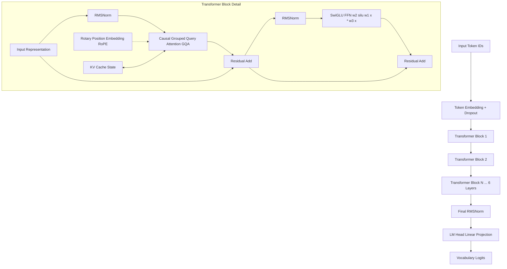

# Custom Neural LLM Architecture & Specifications

## 1. Architectural Blueprint

The Genkit AI custom model is a decoder-only Transformer implemented in native PyTorch. It incorporates modern LLM design principles optimized for real-time inference and training on consumer hardware (NVIDIA RTX 3050 6GB).

---

## 2. Model Hyperparameters

| Hyperparameter | Value | Description |
| :--- | :--- | :--- |
| **Parameters** | ~80M | Total trainable parameter count |
| **Layers (`n_layer`)** | `6` | Transformer decoder blocks |
| **Hidden Dim (`n_embd`)** | `384` | Model representation dimension |
| **Attention Heads (`n_head`)** | `6` | Query attention heads |
| **KV Heads (`n_kv_head`)** | `2` | Grouped-Query Attention (3:1 query:KV sharing ratio) |
| **Head Dim (`head_dim`)** | `64` | Dimension per attention head |
| **Intermediate Dim** | `1024` | SwiGLU hidden layer dimension |
| **Context Length (`block_size`)** | `512` | Maximum context window |
| **Vocab Size (`vocab_size`)** | `10,000` | Byte-Fallback BPE vocabulary |
| **Positional Embedding** | `RoPE` | Rotary Position Embeddings with offset support |
| **Normalization** | `RMSNorm` | Root Mean Square Normalization |
| **Activation** | `SwiGLU` | Gated Swish Linear Unit |
| **Weight Tying** | `True` | Shared embedding and output projection matrix |

---

## 3. Key Innovations & Correctness

### 1. Grouped-Query Attention (GQA) & KV-Caching
- **3:1 Query-to-Key/Value Head Ratio**: Reduces KV memory consumption during inference by 66% while preserving multi-head representational capacity.
- **Accurate KV-Cache Concatenation**: During incremental generation, past keys and values are preserved across layers, executing only single-token forward passes per generation step.

### 2. Rotary Position Embeddings (RoPE) with Offset Support
- Position IDs are computed dynamically as:
  $$\text{position\_ids} = \text{past\_length} \dots \text{past\_length} + \text{current\_length} - 1$$
- Ensures step-by-step cached token generation produces numerically equivalent representations to full non-cached forward passes.

### 3. Byte-Fallback BPE Tokenizer
- 10 Special Control Tokens: `<pad>`, `<bos>`, `<eos>`, `<unk>`, `<context_start>`, `<context_end>`, `<query_start>`, `<query_end>`, `<ans_start>`, `<ans_end>`.
- 256 UTF-8 Byte Tokens (`<0x00>` to `<0xFF>`): Guarantees 100% roundtrip encoding/decoding without out-of-vocabulary `<unk>` replacements on unseen unicode characters or emojis.
- Learned BPE merge table trained deterministically on the domain corpus.
