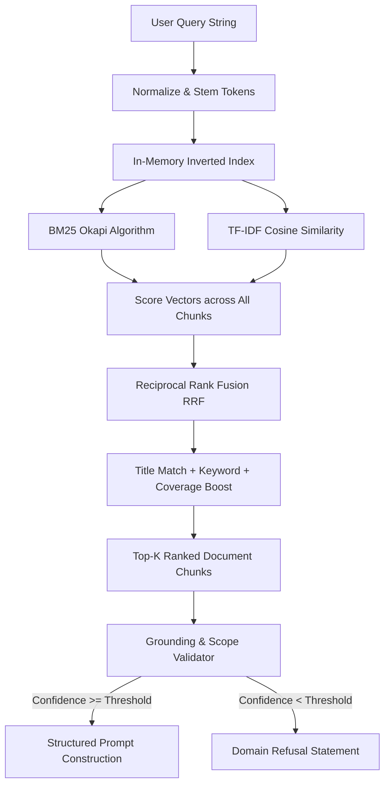

# Hybrid RAG & Grounding Subsystem

## 1. Principles of the Local RAG Engine

Genkit AI uses a **100% deterministic, local lexical retrieval engine**. It avoids external embedding APIs and ungrounded vector databases, relying on mathematically proven information retrieval algorithms.

---

## 2. Algorithms & Scoring Formulas

### 1. Inverted Index
- Pre-computes term postings: $\text{term} \to \{\text{doc\_id}: \text{frequency}\}$.
- Tracks total document count $N$, document lengths, and document frequencies $df$.

### 2. BM25 Okapi Scoring
$$\text{IDF}(q_i) = \ln\left(1 + \frac{N - df(q_i) + 0.5}{df(q_i) + 0.5}\right)$$
$$\text{Score}_{\text{BM25}}(D, Q) = \sum_{i=1}^{n} \text{IDF}(q_i) \cdot \frac{f(q_i, D) \cdot (k_1 + 1)}{f(q_i, D) + k_1 \cdot \left(1 - b + b \cdot \frac{|D|}{\text{avgdl}}\right)}$$
*(Default parameters: $k_1 = 1.5$, $b = 0.75$)*

### 3. TF-IDF Cosine Similarity
- Sublinear term frequency: $w_{t, d} = (1 + \ln(tf)) \cdot \left(\ln\left(\frac{1 + N}{1 + df}\right) + 1\right)$
- Cosine normalization: $\text{CosineSim}(q, d) = \frac{\vec{q} \cdot \vec{d}}{\|\vec{q}\|_2 \cdot \|\vec{d}\|_2}$

### 4. Reciprocal Rank Fusion (RRF) & Reranking
$$\text{RRF}(d) = \frac{w_{\text{bm25}}}{k + \text{rank}_{\text{bm25}}(d)} + \frac{w_{\text{tfidf}}}{k + \text{rank}_{\text{tfidf}}(d)}$$
$$\text{Final Score} = \left(0.40 \cdot \text{Score}_{\text{norm}} + 40.0 \cdot \text{RRF} + 0.35 \cdot \text{Coverage} + \text{Boost}_{\text{title}} + \text{Boost}_{\text{keywords}}\right) \cdot \text{Priority}$$

---

## 3. Grounding Validation & Out-of-Domain Refusal

To prevent hallucinations, every retrieval pass is validated by `GroundingValidator`:
1. **Scope Checking**: Queries are matched against verified Genkit business domain vocabulary.
2. **Confidence Computation**: Computes the token overlap ratio between the query and retrieved context chunks.
3. **Deterministic Refusal**: Any query falling below the confidence threshold or requesting general non-Genkit knowledge (e.g. "What is the capital of France?", recipe queries, general trivia) is rejected with the verified scope message:

> *"I can help with Genkit's company, services, projects, technologies, pricing, and contact information. I don't have verified information about that topic."*
